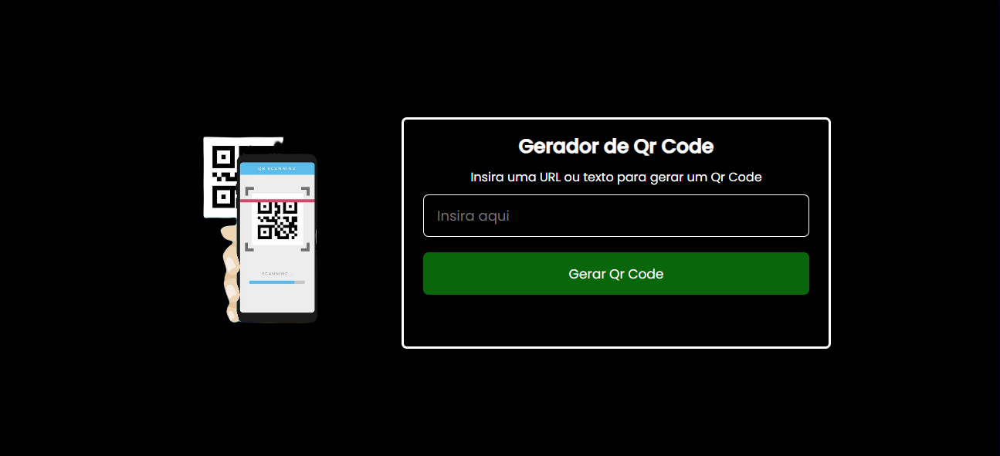
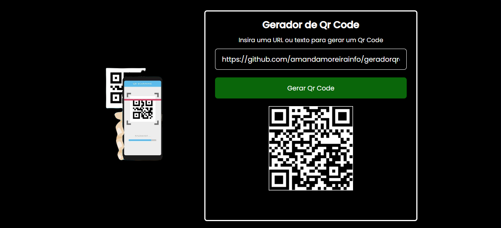

# Gerador de Qr Code

Usar o Gerador de QR Code é simples. Basta inserir as informações que deseja codificar no código QR, como um link para um site, informações de contato ou qualquer texto relevante, e clicar em 'Gerar QR Code'. A aplicação, que foi desenvolvida com HTML, CSS e JavaScript, processará os dados e, por meio da API "QR Server", gerará instantaneamente o código QR correspondente.

# Experimente o Gerador de Qr Code:

https://amandamoreirainfo.github.io/geradorqrcode/

# Capturas de telas

